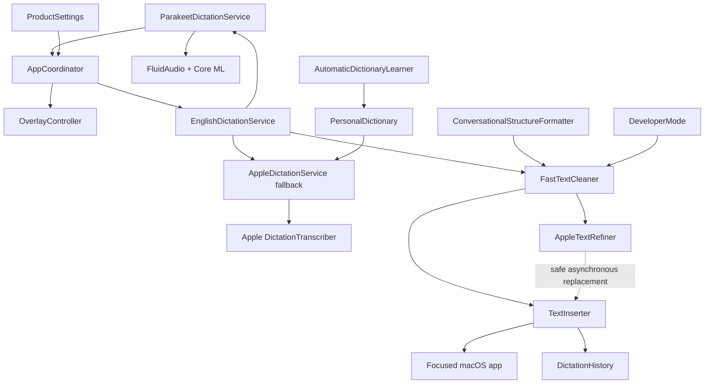

# Talkmore architecture

Talkmore is a native menu-bar application with a deliberately short hot path. Speech recognition, cleanup, settings, history, and optional rewriting run locally on the Mac.

## System map

## Components

| Component | Responsibility |
| --- | --- |
| `TalkmoreAppDelegate` | Owns the menu-bar lifecycle and application activation behavior. |
| `AppCoordinator` | Coordinates key state, recording, finalization, cleanup, insertion, and product state. |
| `PushToTalkMonitor` | Observes global fn/Globe press and release without requiring an active Talkmore window. |
| `EnglishDictationService` | Automatically selects the prepared English engine and falls back without exposing model choices. |
| `ParakeetDictationService` | Streams microphone audio through Parakeet Unified English 320 ms using FluidAudio and Core ML. |
| `AppleDictationService` | Provides the Apple on-device fallback and context-hint path. |
| `FastTextCleaner` | Applies bounded deterministic cleanup and writing-mode commands. |
| `AppleTextRefiner` | Optionally asks the on-device Foundation Models framework to improve inserted wording. |
| `TextInserter` | Plans direct Accessibility insertion or a clipboard/paste fallback and protects later edits. |
| `OverlayController` | Displays a non-activating microphone-level animation without showing live transcript text. |
| `PersonalDictionary` | Stores exact spelling replacements locally and supplies recognition hints. |
| `AutomaticDictionaryLearner` | Learns a repeated correction only within Talkmore's settled insertion range. |
| `ConversationalStructureFormatter` | Converts explicit sequential English ideas or steps into numbered lists. |
| `DictationHistory` | Stores successful dictations locally when history is enabled. |
| `ProductSettings` | Stores writing style, overlay, history, and refinement preferences. Recognition is fixed to English. |

## Latency path

1. Parakeet Unified English and the Apple fallback prepare in parallel. A dictation uses Parakeet as soon as it is ready; otherwise it uses Apple Speech.
2. Audio capture begins immediately. On the Apple path, initial buffers stay ordered behind a short gate until app and personal-dictionary hints are active.
3. On release, Talkmore requests finalization and selects the best final or live result available inside a hard 330 ms trailing-word window.
4. Deterministic cleanup and precompiled dictionary replacement run synchronously.
5. Text is inserted using the safest available route.
6. Optional Apple Intelligence refinement runs afterward and applies only if the cursor state is still compatible.

The visible latency measurement begins at fn release and ends after insertion completes. The target for a warm pipeline is below 0.5 seconds. First-use model preparation is outside the steady-state target.

## Privacy boundary

Talkmore does not implement a transcription backend. Its data paths are microphone audio through local Core ML or Apple Speech, text through in-process cleanup, optional text through Apple’s on-device Foundation Models framework, local app storage, and final text to the focused application. FluidAudio downloads the selected model weights from Hugging Face during first preparation; audio and transcripts are never sent there.

Contributors should treat the lack of network transcription, accounts, and analytics as a product invariant. Network access beyond model distribution must be explicit, opt-in, narrowly scoped, and discussed before implementation.

## Insertion safety

Direct Accessibility replacement is preferred when the focused control exposes a writable text value and selection range. Electron apps, browsers, terminals, and controls with incomplete Accessibility support use a clipboard/paste fallback.

Multiprocess browsers can expose native browser controls and website controls from different processes. Target capture therefore retains the visible frontmost application for activation and compatibility policy, while paste events enter the logged-in session at the focused-control level. This lets the browser route the shortcut to its active native field or renderer without Talkmore guessing which helper process owns the editor.

Optional refinement never blindly replaces text. The insertion plan rejects replacement when the user has moved the cursor or typed after the provisional insertion.

## Extending Talkmore

- Add deterministic speech commands in `FastTextCleaner` with focused regression tests.
- Add editor/app detection in `DeveloperMode` and verify it against `REAL_APP_TESTING.md`.
- Add a writing style through settings, cleanup behavior, UI, and tests together.
- Keep new work off the release-to-insert path unless the latency cost is measured and justified.
- Do not add a network dependency to the core dictation loop.

The [accuracy and speed roadmap](ACCURACY_ROADMAP.md) records measured acceptance gates and clean-room lessons from other local dictation projects.
