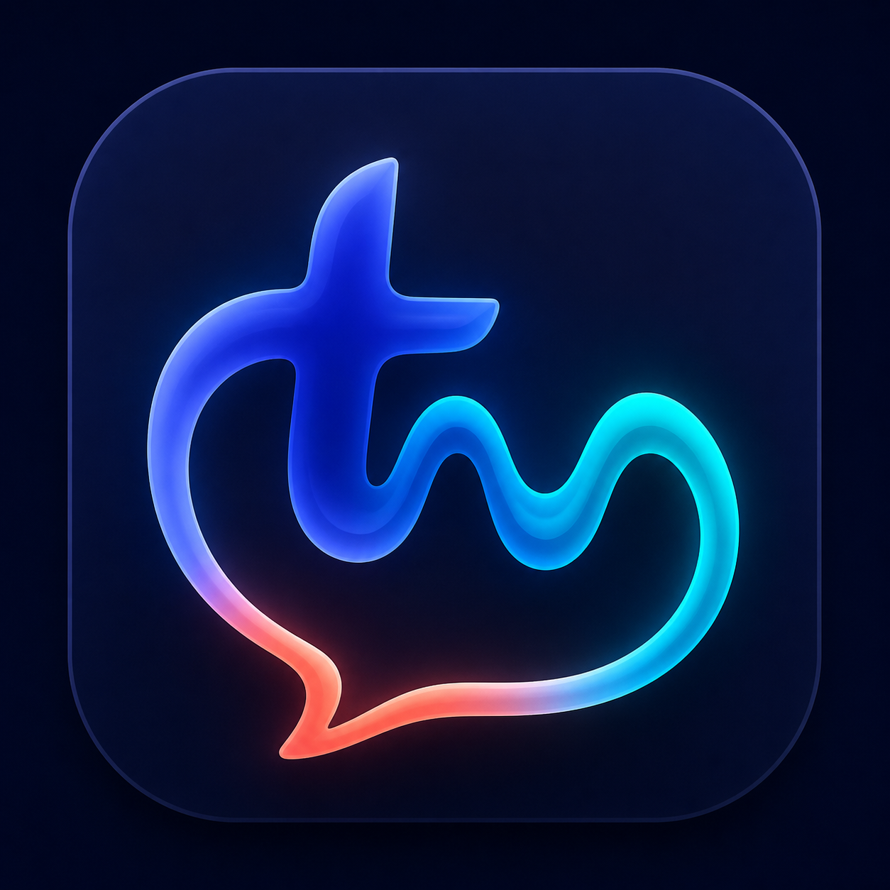

# Talkmore

<p align="center"></p>
<h3 align="center">Your voice, already written.</h3>
<p align="center">Fast, private, open-source push-to-talk dictation for Apple silicon Macs.<br>Hold <strong>fn</strong>, speak naturally, and release to insert clean text anywhere.</p>
<p align="center"><a href="https://mithulram.github.io/Talkmore/">Website</a> · <a href="Docs/INSTALLATION.md">Install</a> · <a href="Docs/PRODUCT_GUIDE.md">Product guide</a> · <a href="https://github.com/mithulram/Talkmore/issues/new/choose">Report a problem</a></p>
<p align="center">   </p>

Talkmore is a native SwiftUI menu-bar app inspired by the speed and simplicity of modern voice tools. It uses Apple Speech locally, inserts into the focused app, and optionally uses Apple Intelligence to polish text _after_ the fast first insertion. There is no Talkmore account, backend, subscription, analytics SDK, or network transcription.

> **Open beta:** Talkmore is useful today, but it is not yet Developer ID signed or notarized. The supported installation path is building from source with Xcode.

## What works today

- Hold **fn/Globe** anywhere to record; release to transcribe and insert.
- On-device recognition through Apple `DictationTranscriber`.
- Warm release-to-insert target below 0.5 seconds; the current local benchmark is approximately 0.40 seconds.
- A bounded finalization window that preserves words spoken immediately before release.
- Accessibility insertion with a safe clipboard/paste fallback.
- Automatic, Everyday, Concise, Email, Developer, and Verbatim writing styles.
- App-aware Email and Developer behavior for Mail, Cursor, Xcode, Codex, and terminals.
- Personal dictionary for names, acronyms, product terms, and exact spelling.
- Optional local history, one-click copy, and configurable voice overlay.
- Optional on-device Apple Intelligence cleanup that never blocks initial insertion.

## Requirements

| Requirement | Why |
| --- | --- |
| Apple silicon Mac | Talkmore currently targets Apple silicon and Apple’s current speech stack. |
| macOS 26 or newer | Required by `DictationTranscriber` and the current deployment target. |
| Xcode 26 or newer | Required to build the open beta from source. |
| Microphone permission | Captures speech while fn is held. |
| Speech Recognition permission | Runs Apple’s speech recognizer. |
| Accessibility permission | Inserts text into the focused app. |
| Input Monitoring permission | Detects the fn key globally. |

Apple Intelligence is optional. Raw transcription and deterministic cleanup work without it.

## Install

```sh
git clone https://github.com/mithulram/Talkmore.git
cd Talkmore
open Talkmore.xcodeproj
```

In Xcode, choose the **Talkmore** scheme and press **Run**. On first launch, open Talkmore from the menu bar and grant the four permissions above. Then hold **fn**, speak, and release.

If macOS opens Emoji, starts system Dictation, or changes input source when fn is pressed, set **System Settings → Keyboard → Press fn key to → Do Nothing**.

See the [complete installation and troubleshooting guide](Docs/INSTALLATION.md) before opening an issue.

## How it stays fast


The speech pipeline is prepared ahead of use. While fn is held, recognition remains internal. On release, Talkmore waits only long enough for Apple Speech to deliver the trailing word, performs deterministic cleanup, and inserts. Optional language-model rewriting happens later and replaces the provisional text only when the cursor is still safe.

Read [Architecture](Docs/ARCHITECTURE.md) for the component map, latency budget, privacy boundary, and extension points.

## Writing modes

| Mode | Best for | What it changes |
| --- | --- | --- |
| Automatic | Daily use | Chooses Email, Developer, or Everyday from the focused app. |
| Everyday | Notes and chat | Cleans filler words and punctuation while preserving meaning. |
| Concise | Short replies | Optionally tightens wording after insertion. |
| Email | Mail and long replies | Handles subject lines, paragraphs, greetings, and sign-offs. |
| Developer | Editors and terminals | Preserves technical terms and converts spoken casing, symbols, and filenames. |
| Verbatim | Exact wording | Keeps recognized wording with only outer whitespace removed. |

The [product guide](Docs/PRODUCT_GUIDE.md) covers styles, dictionary, history, customization, and privacy behavior.

## Test

```sh
xcodebuild -project Talkmore.xcodeproj -scheme Talkmore test
```

The automated suite covers dictation state, cleanup, insertion planning, developer mode, dictionary, history, and product settings. For manual cross-app checks, use the [real-app compatibility checklist](Docs/REAL_APP_TESTING.md).

## Project status

Talkmore is an open beta. The core local dictation loop is working; distribution and long-tail compatibility are still maturing.

- **Now:** reliable local dictation, fast insertion, dictionary, history, writing modes, and menu-bar controls.
- **Next:** Developer ID signing, notarized downloads, automatic updates, and launch at login.
- **Exploring:** memory-adaptive local correction models that load only when requested.
- **Later:** multilingual accuracy and latency benchmarks across common Mac apps.

See the [open issues](https://github.com/mithulram/Talkmore/issues) for current work.

## Contributing

Bug reports, compatibility results, documentation fixes, and focused pull requests are welcome. Start with [CONTRIBUTING.md](CONTRIBUTING.md), follow the [Code of Conduct](CODE_OF_CONDUCT.md), and report vulnerabilities privately as described in [SECURITY.md](SECURITY.md).

## License

Talkmore is available under the [MIT License](LICENSE).
